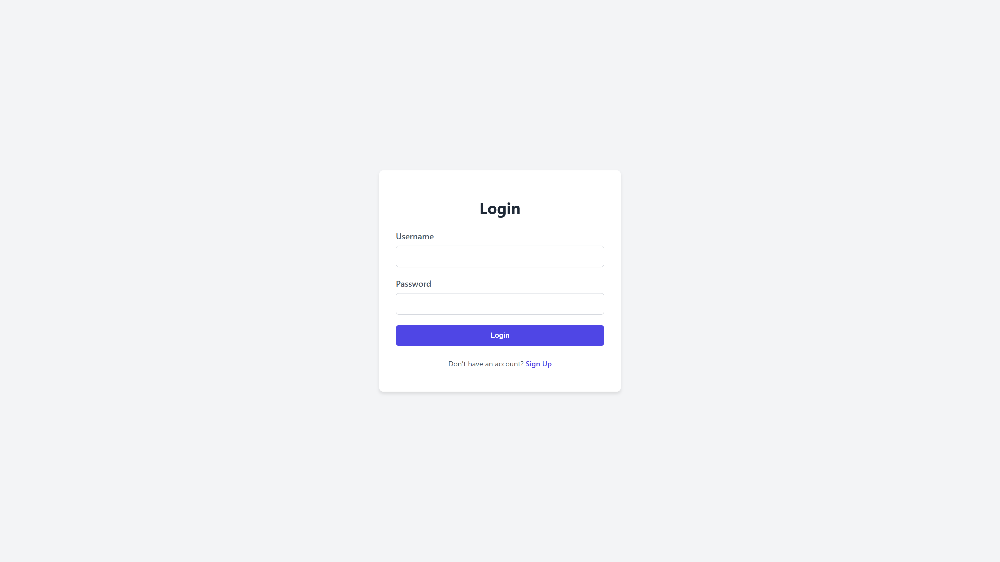

# RisenCore 🚀

**RisenCore: Your Open-Source Digital Life Assistant**

RisenCore is a full-stack web application designed to be a central hub for managing personal life data. From daily tasks and financial transactions to health tracking and AI-powered weekly reviews, RisenCore aims to provide a secure, intuitive, and powerful platform to help you organize your digital life.

This project is being developed to showcase modern, professional, and enterprise-level software development practices using a Java (Spring Boot) backend and a React frontend, fully containerized with Docker.

---

### ✨ Features

- **Secure Authentication:** JWT-based user registration and login system.
- **Role-Based Access Control (RBAC):** Distinct `USER` and `ADMIN` roles with protected endpoints and UI elements.
- **Task Management:** A full CRUD module for users to manage their personal tasks.
- **Financial Tracking:** A module for tracking personal income and expenses.
- **Health Tracking:** Monitor vital health metrics like weight, sleep, and exercise.
- **AI Weekly Review:** Get personalized, AI-generated insights and summaries of your week (powered by Google Gemini).
- **Admin Panel:** A dedicated view for administrators to manage users.
- **Responsive UI:** A clean and modern user interface that works seamlessly on desktop and mobile devices.
- **API Documentation:** Interactive API documentation powered by Swagger/OpenAPI.
- **Database Migrations:** Version-controlled database schema management with Flyway.

---

### 📸 Screenshots

Here's a sneak peek of RisenCore in action:

**Login Page:**


**Dashboard:**


**Admin Panel:**


---

### 🛠️ Tech Stack

**Backend:**
- **Java 17** & **Spring Boot 3**
- **Spring Security** (JWT Authentication)
- **Spring Data JPA** & **Hibernate**
- **PostgreSQL** (Database)
- **Flyway** (Database Migrations)
- **MapStruct** (Object Mapping)
- **Springdoc OpenAPI** (API Documentation)
- **Google Gemini API** (AI Integration)
- **Maven** (Build Tool)

**Frontend:**
- **React**
- **Vite** (Build Tool)
- **Axios** (HTTP Client)
- **React Router** (Routing)
- **React Hot Toast** (Notifications)
- **CSS Modules** (Styling)

**DevOps:**
- **Docker** & **Docker Compose**

---

### 🚀 Getting Started

The easiest way to run RisenCore is using Docker Compose.

**Prerequisites:**
- Docker & Docker Compose installed on your machine.
- Git.

**1. Clone the repository:**
```sh
git clone https://github.com/ersinelmas/RisenCore.git
cd RisenCore
```

**2. Configure Environment:**
- Copy `.env.example` to `.env` and fill in secure values. The backend now reads JWT secrets, database credentials, and the Gemini API key exclusively from environment variables.
- Required variables for the backend:
  ```env
  DB_NAME=risencore_db
  DB_USER=risencore_user
  DB_PASSWORD=replace_with_secure_password
  SPRING_DATASOURCE_URL=jdbc:postgresql://postgres-db:5432/risencore_db

  JWT_SECRET=replace_with_secure_jwt_secret

  GEMINI_API_KEY=replace_with_gemini_api_key
  GEMINI_MODEL_NAME=gemini-2.5-flash

  # Choose the active Spring profile for the backend
  SPRING_PROFILES_ACTIVE=dev  # or prod
  ```
- Frontend-only development also needs an API base URL. Create `frontend/.env` with:
  ```env
  VITE_API_BASE_URL=http://localhost:8080
  ```
  See `frontend/README.md` for detailed npm, environment, and Docker instructions that align with the Compose setup below.

**3. Run with Docker Compose:**
```sh
docker-compose up --build
```
- The backend profile comes from `SPRING_PROFILES_ACTIVE` (in your `.env`); `docker-compose.yml` defaults to `dev` and `docker-compose.prod.yml` defaults to `prod` if you don't override it.

**That's it!** 🎉

- **Frontend:** Open [http://localhost:5173](http://localhost:5173) in your browser.
- **Backend API:** Running on `http://localhost:8080`.
- **API Documentation:** [http://localhost:8080/swagger-ui.html](http://localhost:8080/swagger-ui.html).

To stop the application:
```sh
docker-compose down
```

---

### 📄 License

This project is licensed under the **Apache License 2.0**. See the `LICENSE` file for details.

Copyright 2025, Ersin Elmas.
